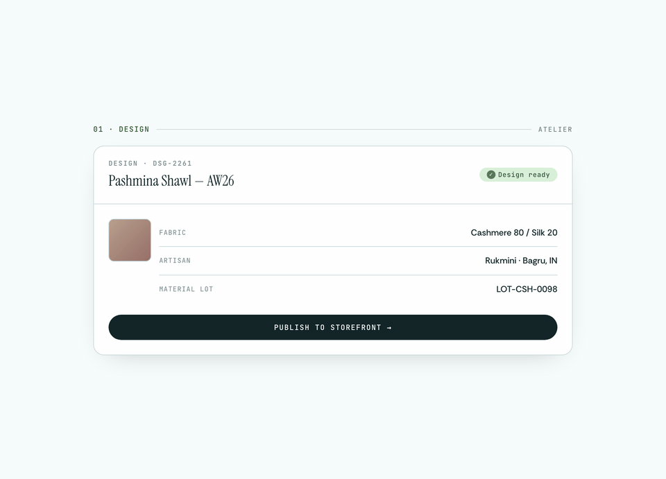

# 🧵 Medo

> **From sketch to shipment. A unified platform for textile and garment production.**

[](https://railway.com/deploy/dv6ZSz?referralCode=qVdmfO) [](https://github.com/Jaal-Yantra-Textiles/v2/actions/workflows/test-and-release.yml)

If we help artisans and consumers
solve supply chain enrichment, production tracking, and selling high-end goods
with an all-in-one design and artisanal garment marketplace featuring e-commerce, pre-production, and operations management — launched without writing code —
they will choose it over competitors
because our solution is uniquely focused on bringing the full source story of every item, emphasizing traceability and premium quality in a market where quality is often overlooked.


<p align="center">
  
</p>

---

## What is Medo?

Medo is an open-source, **textile-first** production platform that brings designers, manufacturers, suppliers, and partners together. Built on [MedusaJS](https://docs.medusajs.com/), it's the single source of truth for tracking and managing your entire garment production—from design concept to finished product.

**Disconnect no more. Collaborate everywhere.**

---

## What You Can Do

✨ **Design & Create** – Store designs, mood boards, and pre-production assets in one place  
📋 **Assign & Track** – Send designs to partners with tasks, get real-time updates  
📦 **Manage Inventory** – Full control over inventory lines, stock levels, and raw materials  
👥 **Partner Portal** – Mobile-first interface for partners to accept, execute, and report on tasks  
📊 **Production Pipeline** – Visual tracking of every step from concept to delivery  
🛒 **E-commerce Integration** – Launch your own branded store without extra overhead  
🔗 **Supply Chain Control** – Connect all your suppliers, manufacturers, and quality teams  
🤖 **AI-Powered Commerce** – Use AI conversations to design, customize, and build your dream e-commerce experience in minutes  

---

## Quick Start

### Prerequisites
- Node.js 18+ and Yarn
- PostgreSQL (or SQLite for development)

### Setup
```bash
# Clone and install
git clone https://github.com/Jaal-Yantra-Textiles/v2
cd v2
yarn install

# Configure environment
cp .env.template .env
# Edit .env with your database and service credentials

# Run migrations and start
yarn medusa migrations run
yarn start
```

Server runs at `localhost:9000` by default.

---

## Architecture

**Core Modules:**
- `designs` – Design management and partner assignment workflows
- `tasks` – Flexible task templates and independent task management
- `inventory_orders` – Supply chain tracking with partner notifications
- `partner` – Multi-tenant partner profiles and workflows
- `analytics` – Real-time production insights and reporting
- `socials` – Social media integration (Instagram, Facebook)
- `website` – Headless e-commerce and content management

**Admin UI** – Full control dashboard for designers and administrators  
**Partner App** – React-based mobile-friendly interface for production partners

---

## Key Features

| Feature | Benefit |
|---------|---------|
| **End-to-End Traceability** | Track each design through every production stage |
| **Task Workflows** | Flexible dependency-based task creation and automation |
| **Partner Integration** | Real-time visibility into partner progress with mobile support |
| **Inventory Control** | Track stock by location, manage consumption, prevent shortages |
| **Workflow Automation** | Trigger actions based on task completion, status changes |
| **Multi-Channel Publishing** | Post designs and products to Instagram, Facebook, and your store |
| **Extensible Design** | Built on MedusaJS—easily add custom modules and workflows |

---

## Development

### Testing
```bash
yarn test:integration:http      # API integration tests
yarn test:integration:modules   # Module-level tests
yarn test:unit                  # Unit tests
```

### Code Generation
```bash
yarn generate-ui          # Generate admin components
yarn generate-api         # Generate API hooks and types
yarn generate-workflows   # Create workflow scaffolds
```

### Partner UI
```bash
yarn partner-ui:dev       # Start partner app (port 5173)
yarn partner-ui:build     # Build for production
```

---

## Contributing

We love contributions! Here's how:

1. Fork the repo
2. Create a feature branch: `git checkout -b feature/amazing-thing`
3. Commit: `git commit -m 'Add amazing thing'`
4. Push: `git push origin feature/amazing-thing`
5. Open a Pull Request

See [CONTRIBUTING.md](CONTRIBUTING.md) for guidelines.

---

## License

MIT © Jaal-Yantra-Textiles

---

## Questions?

- 💬 [GitHub Discussions](https://github.com/Jaal-Yantra-Textiles/v2/discussions)
- 🐛 [Report Issues](https://github.com/Jaal-Yantra-Textiles/v2/issues)
- 📧 [Contact us](mailto:info@jaalyantra.in)

**Let's transform textile production together.**