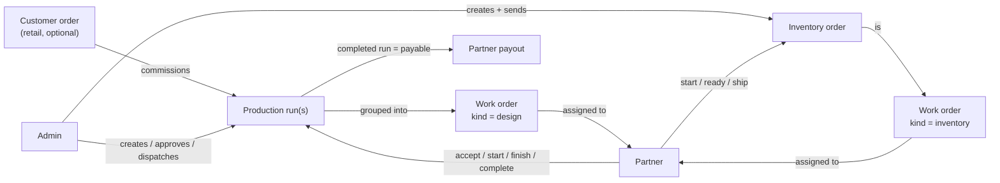
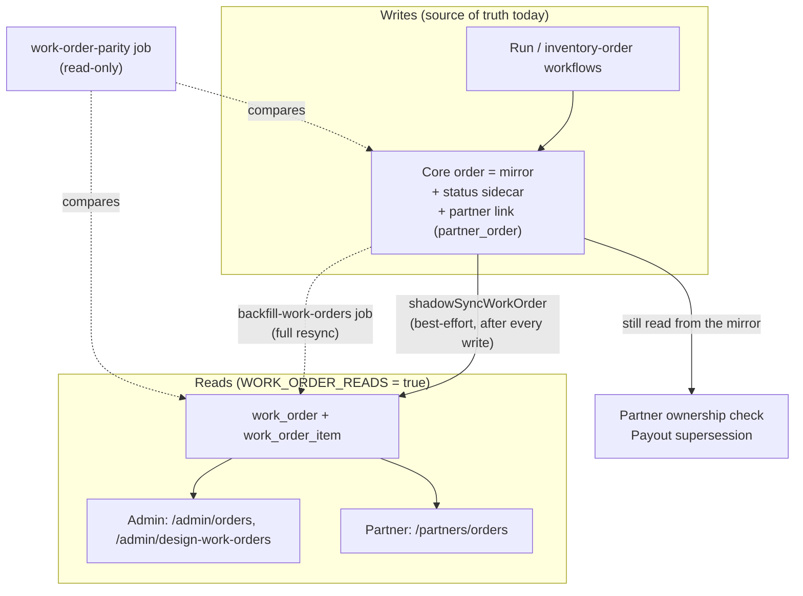
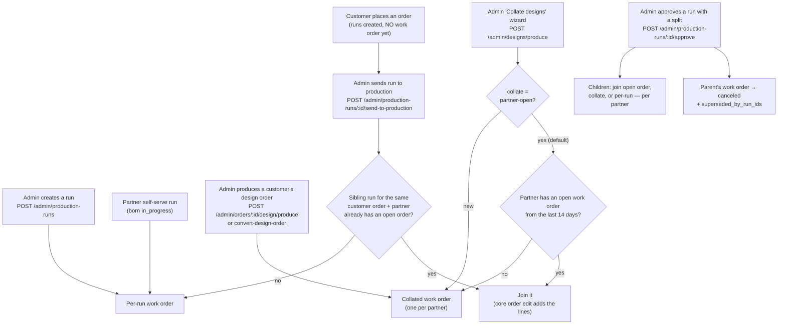
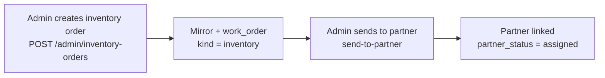
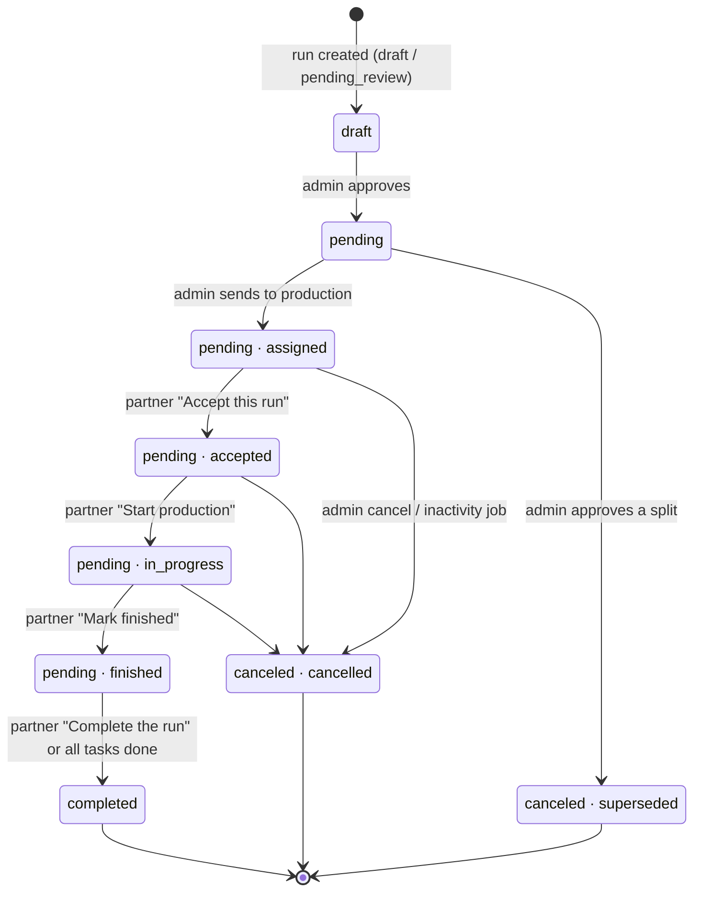
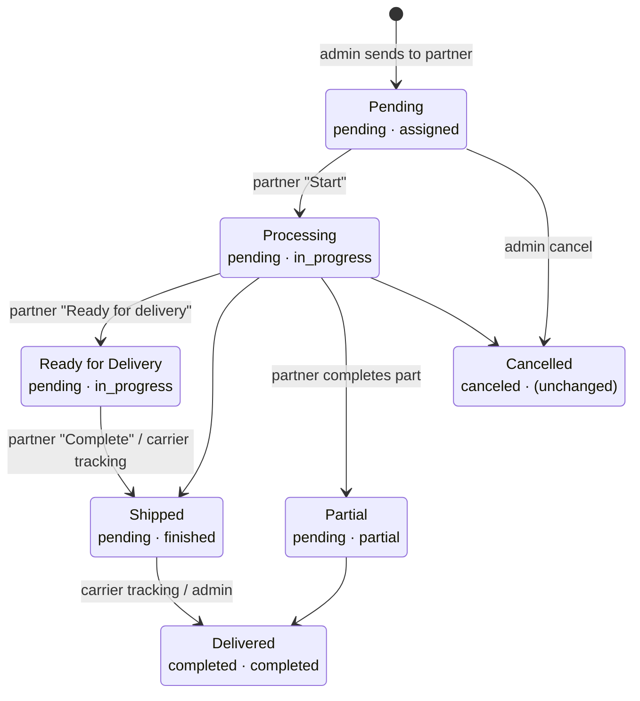
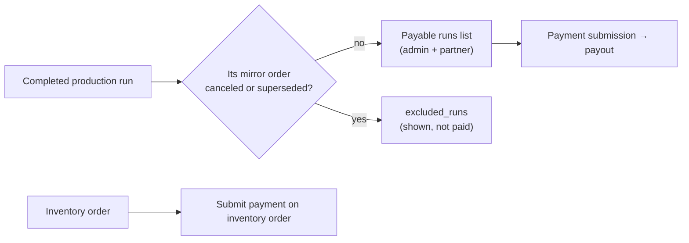
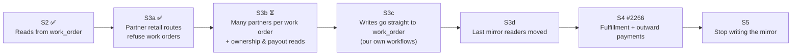

# How work orders flow

*State of the code: 2026-09-26, after S3a (#2294). Epic: #2261.*

A **work order** is the order *we* send to a **partner** (a weaver, tailor, dyer, supplier) asking them to make or supply something. It is the opposite direction of a retail order, which a **customer** sends to us.

There are two kinds:

| Kind | What the partner is asked to do | What it is built from |
|---|---|---|
| `design` | Make one or more designs | One or more **production runs** |
| `inventory` | Supply raw material (cloth, yarn…) | Exactly one **inventory order** |

A design work order is either **`per_run`** (one run) or **`collated`** (several runs for the same partner, grouped into one order). An inventory work order is always `per_run`.

---

## 1. The big picture

**Key idea: the partner never acts on the work order itself.** They act on the *run* or the *inventory order*, and the work order's status follows.

---

## 2. Where the data lives today

Work orders used to be stored as ordinary core Medusa orders (the **"mirror"**) on a hidden **Partner Work Orders** sales channel. Epic #2261 is moving them to our own `work_order` table. We are halfway:

- **Writes** still go to the **mirror** first. A shadow sync then copies the mirror into `work_order`.
- **Reads** come from `work_order` (flag `WORK_ORDER_READS=true`, on in prod since 2026-09-25).

Things to know:

- The work order **keeps the mirror's id** (`order_…`) and display number, so links and URLs did not change.
- If the shadow sync fails it only logs a warning. The **`work-order-parity`** job is how we find out. Last run: 106/106 matching.
- Two readers still use the mirror: **which partner may see an order** and **whether a run is payable**. Moving them is S3b (#2265).
- Rollback: delete `WORK_ORDER_READS` from the two Copilot manifests. The mirror is still fully written, so nothing is lost.

### What a `work_order` row holds

| Field | Meaning |
|---|---|
| `id`, `display_id` | Same as the mirror order |
| `kind` | `design` or `inventory` |
| `collation` | `collated` or `per_run` |
| `status` | Core order status: `draft`, `pending`, `completed`, `canceled` (plus unused core values) |
| `partner_status` | The partner's progress: `assigned → accepted → in_progress → finished → completed`, plus `partial`, `cancelled`, `declined` |
| `partner_id` | **One** partner only (see watch-outs) |
| `source_order_id` | The customer order that commissioned it, if any |
| `inventory_order_id` | For `kind = inventory` |
| `superseded_by_run_ids` | Set when the run was split into child runs and this order was replaced |
| `items[]` | One line per run or inventory line: title, qty, unit price, `design_id`, `production_run_id` |

Links: work order ↔ **production runs** (one work order, many runs; a run is on at most one work order). Work order → partner, → inventory order, and line → design are read-only links over the columns.

---

## 3. How a design work order is born

Every path below creates the **mirror**, then shadow-syncs it.

The **partner is attached** (the `partner_order` link, `partner_status = assigned`) when the run is **sent to production**. For outsourced runs, the sub-partner is linked too.

## 4. How an inventory work order is born

---

## 5. Design work order: status

The work order has **no status of its own**. It copies its run(s).

*Labels read "core status · partner_status".* Admin has the same accept / start / finish / complete buttons on the production-run page.

**Collated orders:** core status is aggregated across the runs, and `partner_status` is the **least advanced** run. One run still at `accepted` holds the whole order at `accepted`.

**Once superseded, a work order is frozen.** Later run changes do not touch it.

**Partner decline:** `/partners/production-runs/:id/decline` puts the run back up for reassignment and does **not** change the work order. Nothing in the code ever sets `partner_status = declined`.

## 6. Inventory work order: status

- **"Delivered" is a carrier event. It moves no stock.** Only a **receipt** does: the admin receives it, or the receiving partner confirms it under *Incoming deliveries*.
- **Cancelled leaves `partner_status` as it was.** A cancelled inventory work order can still show `in_progress` to the partner.

---

## 7. Every action, in one table

### Partner (partner-ui)

| Button | Where | API | Effect on work order |
|---|---|---|---|
| Accept this run | Run card | `POST /partners/production-runs/:id/accept` | → accepted |
| Start production | Run card | `…/start` | → in_progress |
| Mark finished | Run card | `…/finish` | → finished |
| Complete the run | Run card | `…/complete` | → completed |
| Decline | — | `…/decline` | none (run is reassigned) |
| Start | Inventory order | `POST /partners/inventory-orders/:id/start` | → in_progress |
| Ready for delivery | Inventory order | `…/ready-for-delivery` | stays in_progress |
| Complete | Inventory order | `…/complete` | → finished or partial |
| Create shipment | Inventory order | `…/shipment` | none directly; tracking moves it |
| Edit lines & tax | Inventory order | order-lines / charges | lines re-synced when approved |
| Submit payment | Inventory order | `…/submit-payment` | none |
| Cancel / fulfill / ship / transfer / credit… | Retail order routes | 15 routes under `/partners/orders/:id/…` | **Refused** for work orders (S3a) |

### Admin

| Action | API | Effect on work order |
|---|---|---|
| Create production run | `POST /admin/production-runs` | new per-run work order |
| Produce a design order | `POST /admin/orders/:id/design/produce` | new collated work order(s) |
| Collate designs wizard | `POST /admin/designs/produce` | joins an open order, or a new collated one |
| Approve run (with split) | `POST /admin/production-runs/:id/approve` | parent superseded, children placed |
| Send to production | `POST /admin/production-runs/:id/send-to-production` | partner linked → assigned (and creates the order for customer-order runs) |
| Accept / start / finish / complete run | `/admin/production-runs/:id/*` | same as the partner buttons |
| Cancel run | `POST /admin/production-runs/:id/cancel` | → canceled (the run, its children and its parent) |
| Create inventory order | `POST /admin/inventory-orders` | new inventory work order |
| Send inventory order to partner | send-to-partner | partner linked → assigned |
| Cancel inventory order | `/admin/inventory-orders/:id/cancel` | → canceled |
| Open a work order | `/orders/:id` | redirects: inventory → inventory order page, one run → run page, collated → *Design Work Orders* |

### System

| Trigger | Effect |
|---|---|
| All tasks on a run completed (subscriber) | run → completed |
| `cancel-inactive-production-runs` job | stale runs → canceled |
| Carrier tracking webhook | inventory → Shipped / Delivered |

---

## 8. Money

- **Partners are paid per run, not per work order.** The work order only matters for payouts because a **canceled or superseded** order excludes its run. This check still reads the **mirror** (`run-supersession.ts`); S3b PR3 moves it.
- **Work orders carry no commission.** The platform fee accrues only on retail orders. 44 old fee rows on work orders were reversed.
- **Payment never changes a work order's status.**

---

## 9. What is not built yet

## 10. Watch-outs

- **One partner per row.** `work_order.partner_id` keeps only the first linked partner, and not in a fixed order. That is why ownership still reads the mirror's `partner_order` link. S3b adds a many-to-many link.
- **Admin core order routes have no guard.** `/admin/orders/:id/cancel` on a work order skips the work-order writers. Only a resync repairs it. (#2305)
- **`declined` is never set.** A declined run goes back for reassignment. The work order doesn't record it. (#2303)
- **A cancelled inventory work order keeps its old `partner_status`.** (#2304)
- **`run.order_id` is the customer order, not the work order.** The work order is found through the work order ↔ run link.
- **Admin order list shows superseded work orders.** The partner list hides them.

## Where the code is

| Piece | Path (under `apps/backend/src/`) |
|---|---|
| Model | `modules/work_orders/models/` |
| Shadow sync | `lib/work-orders/sync-from-mirror.ts` |
| Reads + flag | `lib/work-orders/read-work-orders.ts`, `admin-order-reads.ts`, `to-order-shape.ts` |
| Design work orders (create, collate, status) | `workflows/production-runs/dual-write-unified-run-order.ts` |
| Inventory work orders | `workflows/inventory_orders/dual-write-unified-order.ts` |
| Run → partner status | `workflows/production-runs/lib/run-partner-status.ts` |
| Payout supersession | `workflows/payment_submissions/lib/run-supersession.ts` |
| Jobs (backfill, parity) | `api/admin/ops/maintenance-jobs/work-order-jobs.ts` |
| Partner route guard (S3a) | `api/partners/helpers.ts` → `assertNotWorkOrder` |
